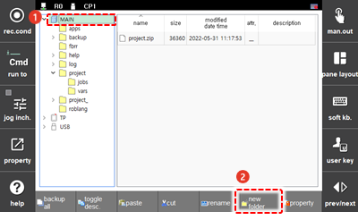
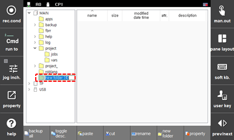

# 4.2.3.2 Folder Creation

1.	Select a folder in the folder list using the jog dial of the teach pendant and then touch the \[New Folder\] button on the function button bar. Then, a new folder will be added under the selected folder.

    

2.	Input the name of the new folder and then press the <<b>ENTER</b>> key.

    

