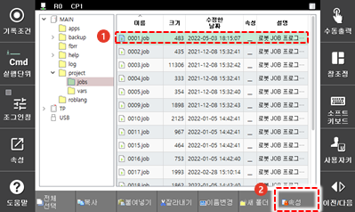
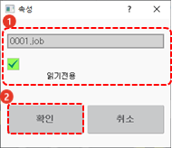

# 4.2.4 파일 보호

프로그램을 변경하거나 삭제할 수 없도록 설정하여 중요한 파일을 보호합니다.

1.	파일을 선택한 후 \[**속성**\] 버튼을 터치하십시오. 속성 설정창이 나타납니다. 

2.	파일 이름을 확인하고 \[**읽기전용**\] 체크박스를 터치하여 선택한 후 \[**확인**\] 버튼을 터치하십시오. 파일 목록의 속성에 보호 표시\(W\_\)가 나타납니다.

