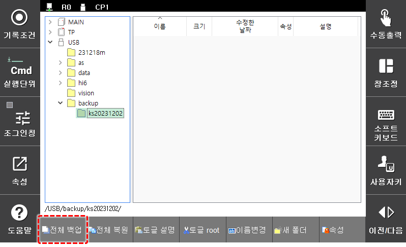
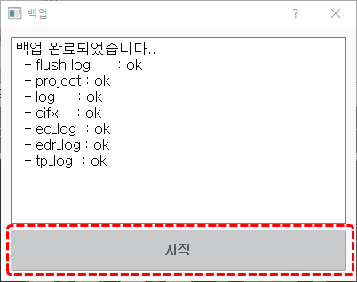

# 4.2.5 Backup all

You can backup the controller's files, such as the project, log.

1. In the Teach Pendant\(T/P\) or USB Storage Device in the folder tree, use the direction keys on the Teach Pendant to select the target folder where you want to save the backup.

    

2. Press the `SHIFT` key and click the `[backup all]` button on the bottom of the screen.

    

3. Click the 'Start' button to `start` the backup. Once Backup\(approximately 1 minute\) is complete, check the results of the backup in the results window.

    

