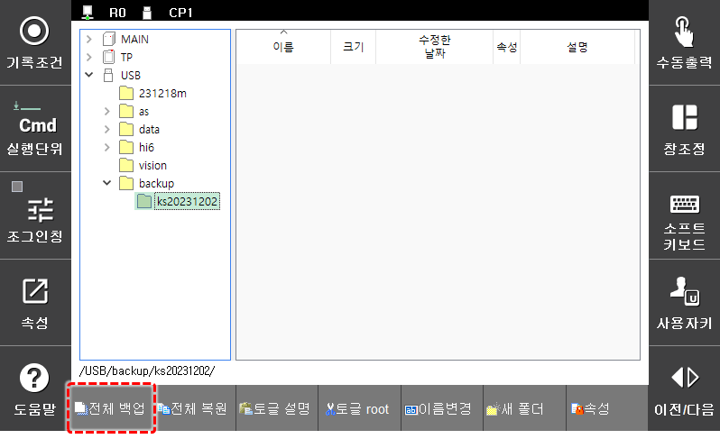
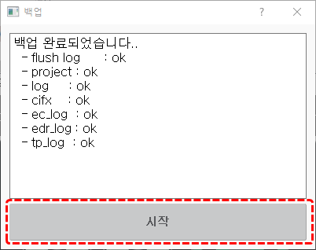

# 4.2.5 备份所有

您可以备份控制器的文件，例如项目、日志。

1. 在教学挂件\(T/P\)或USB存储设备的文件夹树中，使用教学挂件上的方向键选择您希望保存备份的目标文件夹。

    

2. 按下`SHIFT`键并点击屏幕底部的`[backup all]`按钮。

    

3. 点击“开始”按钮以` (start)`开始备份。一旦备份（大约1分钟）完成，请在结果窗口中检查备份结果。

    