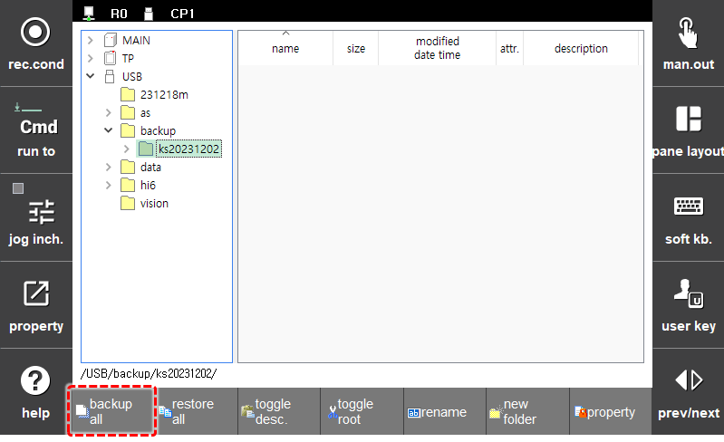
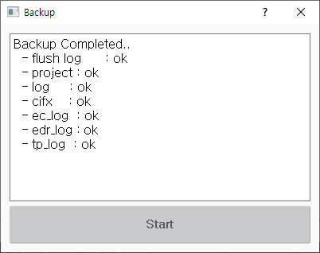

# 4.2.5 전체 백업

프로젝트, 이력\(log\) 등 제어기의 파일들을 백업합니다.

1.	폴더 목록의 티치 펜던트\(T/P\) 또는 이동식 저장 장치\(USB\)에서 티치 펜던트의 방향키를 이용해 백업을 저장할 대상 폴더를 선택하십시오. 

2.	`SHIFT` 키를 누른 상태에서 화면 하단의 `[전체 백업]` 버튼을 클릭하십시오.

3.	`시작` 버튼 클릭해 백업을 시작하십시오. 백업\(약 1분 소요\)이 완료되면 결과창에서 백업 결과를 확인하십시오.

