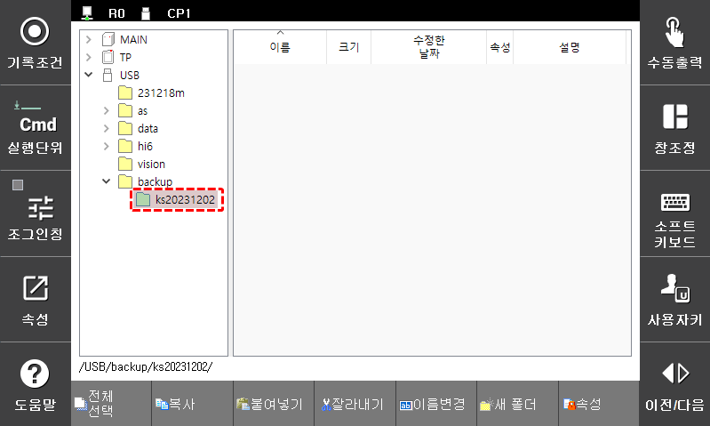
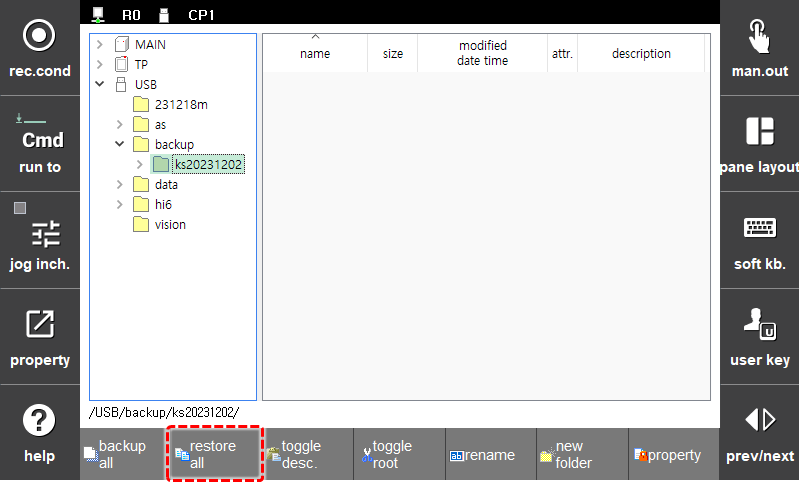
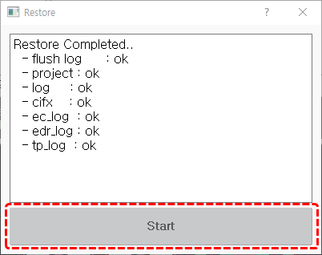

# 4.2.6 Restore all

You can restore files such as projects, logs which backed up with `backup all` features to the system.

1. In the Teach Pendant\(T/P\) or removable storage\(USB\) in the folder list, select the folder that you backed up all using the direction keys on the Teach Pendant.

    

2. Press the `SHIFT` key and click the `restore all` button on the bottom of the screen.

    

3. Click the `Start` button to start the restoration. Once the restoration (It takes about 1 minute.) is complete, check the results of the restoration in the results window.

    

4. Turn off and on the power the controller.
