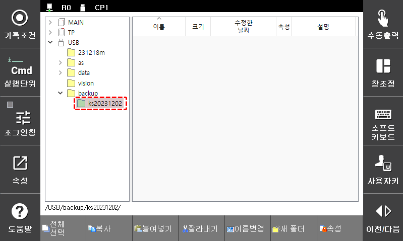
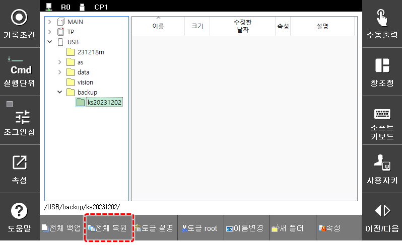
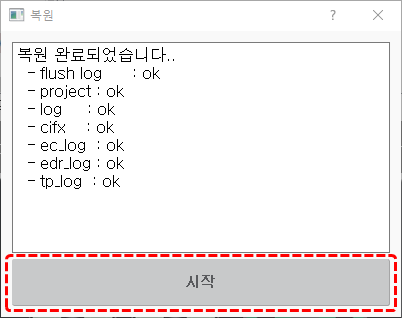

# 4.2.6 恢复所有

您可以将使用 `全部备份 (backup all)` 功能备份的项目、日志等文件恢复到系统中。

1. 在教导手柄\(T/P\)或可移动存储\(USB\)的文件夹列表中，使用教导手柄上的方向键选择您备份的文件夹。

    

2. 按下 `SHIFT` 键并点击屏幕底部的 `全部恢复 (restore all)` 按钮。

    

3. 点击 `开始 (Start)` 按钮以开始恢复。一旦恢复（大约需要 1 分钟）完成，请在结果窗口中检查恢复结果。

    

4. 关闭控制器的电源，然后再重新打开。