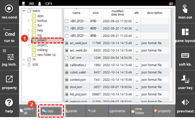
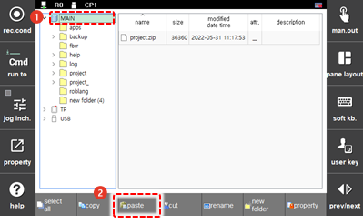
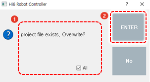

# 4.2.6 Partial Restoration

When restoring only some folders or files of backup data, use the `Copy` and `Paste` feature.

1. By using the teach pendant’s jog dial, select the project \(project/\) folder backed up in the teach pendant \(T/P\) or removable storage device\(USB\), and then click the `[copy]` button.

    

2. By using the teach pendant’s jog dial, select the \[MAIN\] folder in the folder list, and then touch the `[Paste]` button.

    

3. In the duplicate notification window, touch the checkbox for \[All\] to select it, and then touch the \[OK\] button. The backup data will be restored on the main board.

    

4. Turn the power of the controller back on.

