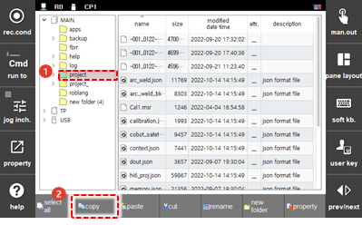
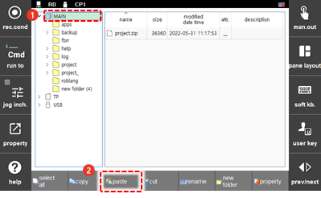
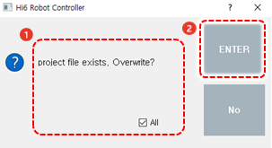

# 4.2.6 部分恢复

在仅恢复备份数据的某些文件夹或文件时，请使用 `复制 (Copy)` 和 `粘贴 (Paste)` 功能。

1. 使用教导台的 jog dial，选择备份在教导台 \(T/P\) 或可移动存储设备 \(USB\) 中的项目 \(project/\) 文件夹，然后点击 `[copy]` 按钮。

    

2. 使用教导台的 jog dial，选择文件夹列表中的 `[MAIN]` 文件夹，然后触摸 `[Paste]` 按钮。

    

3. 在重复通知窗口中，触摸 `[All]` 的复选框以选择它，然后触摸 `[OK]` 按钮。备份数据将被恢复到主板上。

    

4. 重新打开控制器的电源。