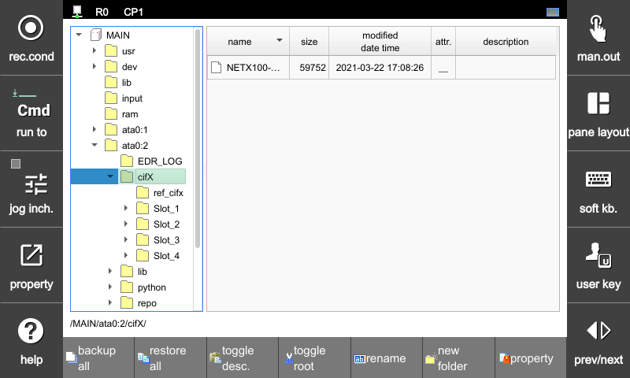

# 4.2.8 toggle root


Supported from V60.26-00.


In the tree window on the left side of the file-manager, the MAIN and TP nodes show only the home folder that the user is allowed access to. The areas outside the home folder are system folders and should not be accessed by the user.

If it is essential during maintenance, you can click the `[toggle root]` button at the bottom of the screen to enter the system folder accessible mode.

Once in accessible mode, the following warning message is displayed, and the MAIN and TP nodes display up to the system's root folder.

Click the `[toggle root]` button once more to release the accessible mode.
