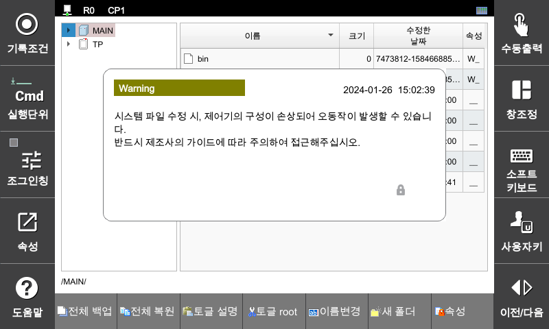
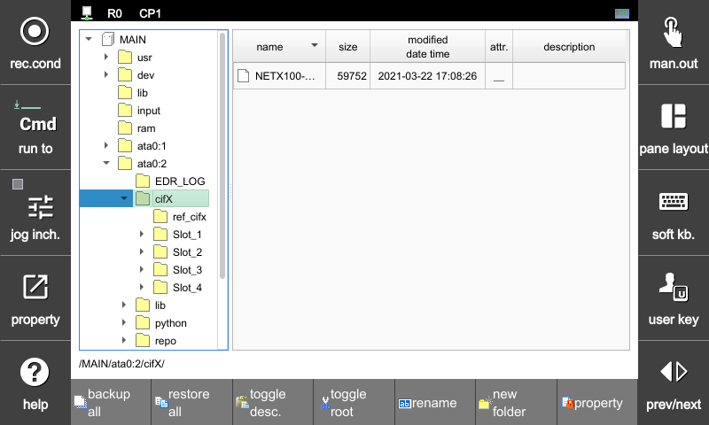

# 4.2.8 切换根目录


支持从 V60.26-00 开始。


在文件管理器左侧的树形窗口中，MAIN 和 TP 节点只显示用户允许访问的主文件夹。主文件夹外的区域是系统文件夹，用户不应访问。

如果在维护过程中必要，可以点击屏幕底部的 `[toggle root]` 按钮进入系统文件夹可访问模式。

一旦进入可访问模式，将显示以下警告信息，MAIN 和 TP 节点显示系统的根文件夹。

再次点击 `[toggle root]` 按钮以释放可访问模式。