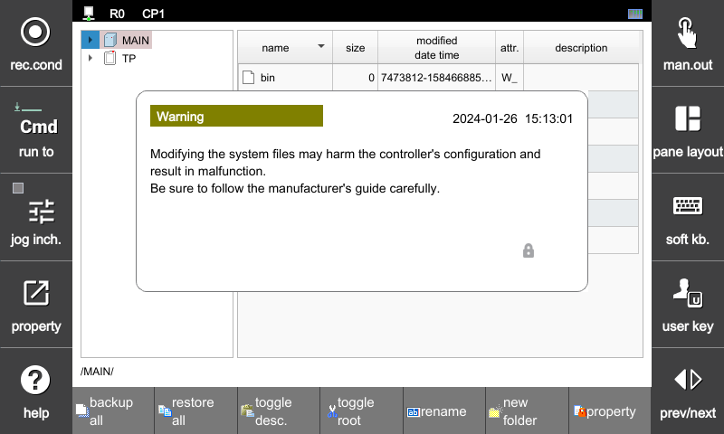

# 4.2.8 토글 root


V60.26-00 부터 지원됩니다.


파일관리자 좌측의 트리창에 표시되는 MAIN과 TP 노드는 사용자에게 접근이 허가된 home 폴더 이하 만을 보여줍니다. home 폴더 바깥 영역은 시스템 폴더들로서 사용자가 함부로 접근해서는 안됩니다.

유지보수 작업 중 꼭 필요한 경우라면, 화면 하단의 `[토글 root]`버튼을 클릭하여 시스템 폴더 접근 가능 모드로 전환할 수 있습니다.

접근 가능 모드에 진입하면 아래와 같은 경고 메시지가 표시되고, MAIN과 TP 노드가 최상단의 시스템 폴더까지 표시합니다.

`[토글 root]`버튼을 한번 더 클릭하면, 접근 가능 모드가 해제됩니다.
