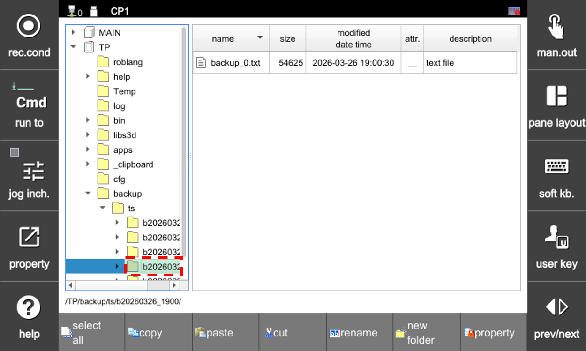
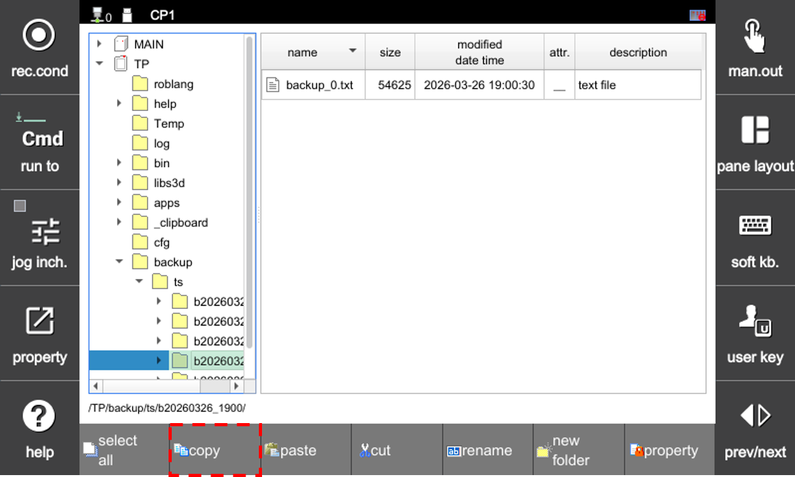
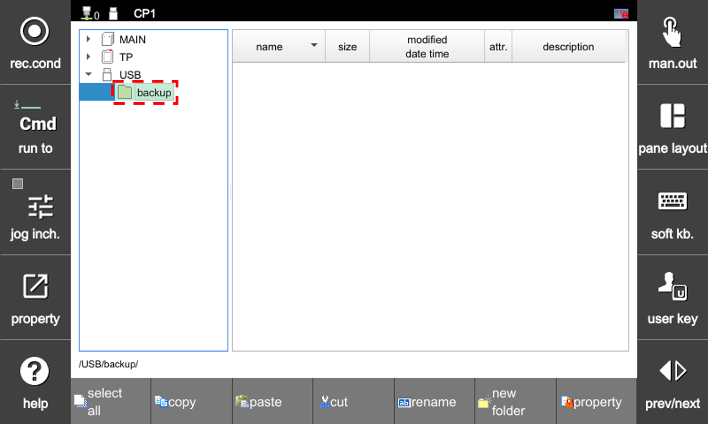
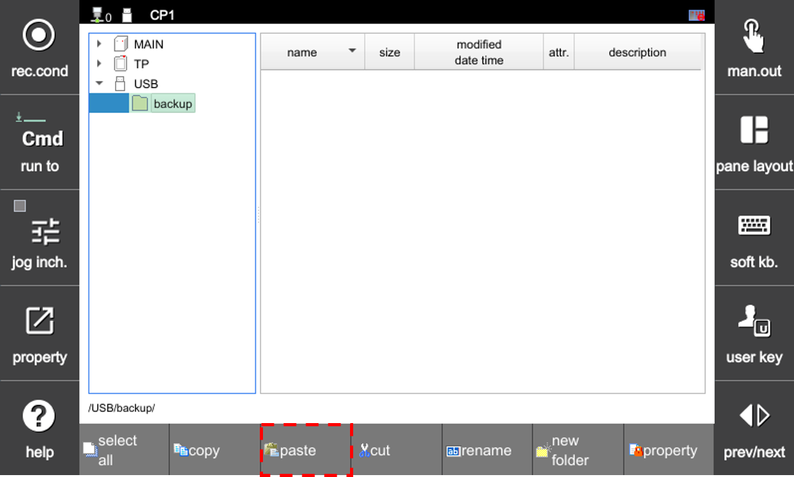
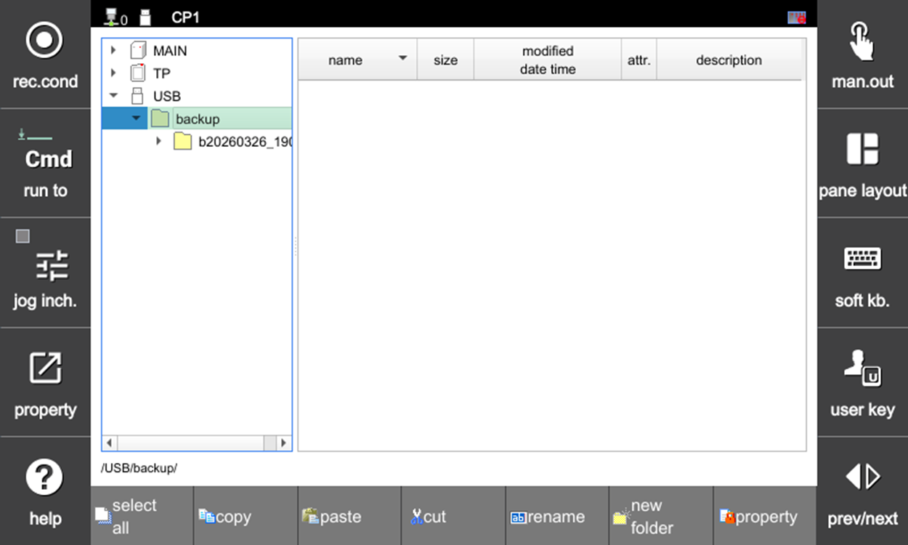

# 4.2.9 Import Automatic Backup

Import the automatic backup configured in System - Automatic Backup and Restore.

1. On the File Manager screen, navigate to backup/ts under the \(T/P\) item, and use the teach pendant arrow keys to select the backup folder to import.

2. Click the `[F2: copy]` button to copy the backup. (This may take approximately 3 minutes.)

3. From the folder list, select the destination folder on the removable storage device (USB) using the teach pendant arrow keys.

4. Click the `[F3: paste]` button to transfer the backup to the storage device (USB).

5. Once completed, verify the result on the File Manager screen.

