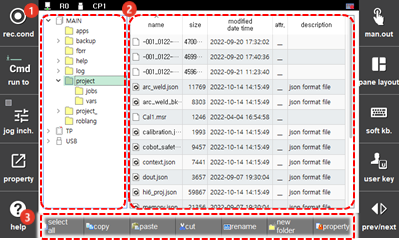

# 4.2 文件管理

您可以管理主板的内部存储、教学挂件或可移动存储设备中的文件。

1. 触摸`[5: 文件管理]`菜单。然后，将显示各设备的文件夹列表以及所选文件夹中保存的文件列表。

2. 按设备检查和管理文件夹结构和保存的文件。

    

<table>
  <thead>
    <tr>
      <th style="text-align:left">编号</th>
      <th style="text-align:left">描述</th>
    </tr>
  </thead>
  <tbody>
    <tr>
      <td style="text-align:left">
        
      </td>
      <td style="text-align:left">
        
这是主板内部存储、教学挂件和可移动存储设备中的文件夹列表。您可以检查文件夹结构。

        <ul>
          <li>[主板]: 保存于主板 (M/B) 的文件将用于实际的机器人操作。</li>
          <li>[教学挂件] / [USB]: 教学挂件 (T/P) 和可移动存储设备 (USB) 将用于数据备份。[</b> <b>USB]</b> 文件夹仅在可移动存储设备连接到教学挂件时出现。</li>
          <li>您可以通过旋转教学挂件上的 jog 旋钮在文件夹列表中移动光标。</li>
          <li>如果您在文件夹列表中选择或[
            ]并按下<b>`[ENTER]`</b>键，您可以显示或隐藏子文件夹。</li>
          <li>当您选择一个文件夹时，可以检查文件夹中保存的文件列表。</li>
        </ul>
      </td>
    </tr>
    <tr>
      <td style="text-align:left">
        
      </td>
      <td style="text-align:left">显示所选文件夹中保存的文件列表。您可以检查每个文件的名称、大小、最后修改日期、保护状态和其他信息。</td>
    </tr>
    <tr>
      <td style="text-align:left">
        
      </td>
      <td style="text-align:left">您可以使用功能按钮管理文件和文件夹。</td>
    </tr>
  </tbody>
</table>


* 这是R代码中“R17 文件管理”的相同功能。
* 当可移动存储设备连接到教学挂件时，`[USB]`图标 \(\) 将出现在 ${cont_model} 教学挂件屏幕的状态栏上。



在执行复制或删除文件等操作时，请勿从教学挂件中移除可移动存储设备。数据可能会损坏。
