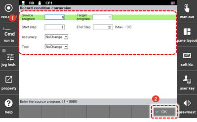

# 4.3.1 录制条件

您可以更改和设置程序特定步骤的录制条件，然后将其应用于现有程序，或编写新程序。

1. 触摸 `[6: Program Conversion - 1: Record condition conversion] ([6: Program Conversion  - 1: Record condition conversion])` 菜单。然后，录制条件转换设置窗口将出现。

2. 在设置录制条件选项后，触摸 `[OK]` 按钮。

    

* `[Source program]`/`[Target program]`: 您可以输入要更改其录制条件的原始程序的编号 \(初始设置值: 当前选定程序\) 和更改录制条件后您想保存的新程序的编号。如果您将目标程序的编号设置为与原始程序的编号相同，则原始程序将被新程序覆盖和替换。
* `[Start Step]`/`[End Step]`: 您可以设置将应用录制条件更改的步骤范围 \(初始设置值: 1/最后一步\)。
* `[Accuracy]`, `[Tool]`: 您可以更改录制条件。