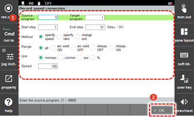

# 4.3.2 录制速度转换

您可以更改程序特定步骤的录制速度，并将其应用于现有程序，或创建新程序。

1.	触摸 `[6: Program Conversion - 2: Record speed conversion] ([6: Program Conversion  - 2: Record speed conversion])` 菜单。然后，录制速度转换设置窗口将出现。

2.	在设置录制速度选项后，触摸 `[OK]` 按钮。

    

* `[Source program]`/`[Target program]`：您可以输入要更改其录制速度的原始程序的编号 \(初始设置值：当前选定的程序\) 和更改录制速度后要保存的新程序的编号。如果您将目标程序的编号设置与原始程序的编号相同，则原始程序将被新程序覆盖和替换。
* `[Start Step]`/`[End Step]`：您可以设置要应用录制速度更改的步骤范围 \(初始设置值：1/最后一步\)。
* `[Method]`：您可以设置指定速度的方法。
  * `[specify Speed]`：您可以批量转换录制的速度。
  * `[specify ratio]`：如果录制速度的单位和在 `[Unit]` 选项中选择的速度单位匹配，则速度可以转换为相对于录制速度的比例。
  * `[change unit]`：您可以转换录制速度的单位。
* `[Range]`：您可以在希望更改录制速度的步骤范围内设置应用部分。
* `[Unit]`：您可以设置速度单位。当速度指定方法选择为 `[specify ratio]` 时，仅与步骤中记录的速度单位匹配的那些将转换为比例的百分比。
* `[Speed]`：如果您选择 `[specify ratio]` 作为速度指定方法，则这将表示比例值。