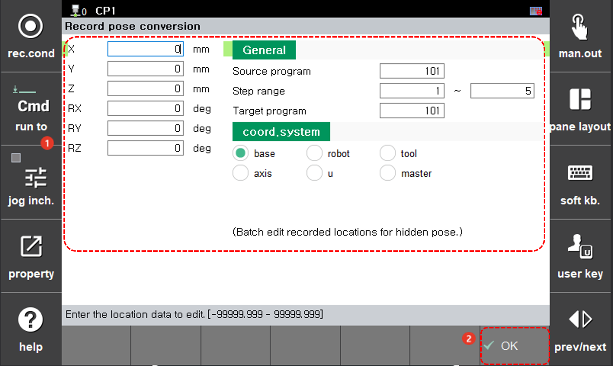

# 4.3.3 录制位置

您可以更改和设置在程序特定步骤中记录为隐藏姿势的步骤位置的坐标系统，并将其应用于现有程序或创建新程序。

1. 触摸`[6: 程序转换 - 3: 录制姿势转换] ([6: 程序转换  - 3: 录制姿势转换])`菜单。然后将出现录制位置转换设置窗口。

2. 在设置录制位置选项后，触摸`[确定]`按钮。

  

* `[源程序]`/`[目标程序]`：您可以输入想要更改的原始程序的编号 \(初始设置值：当前选定的程序\) 和您希望在更改录制位置后保存的新程序的编号。如果您将目标程序的编号设置为与原始程序相同，则原始程序将被新的程序覆盖和替换。
* `[步长范围]`：您可以设置要应用录制位置更改的步骤范围 \(初始设置值：1/最后一步\)。
* `[坐标系统格式]`：您可以选择用于移位在步骤中记录的位置数据的坐标系统。如果选择基准、机器人、工具或用户，则位置数据将被转换为笛卡尔坐标值。如果选择关节，则位置数据将被转换为轴角度。