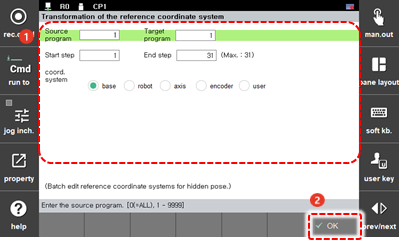

# 4.3.4 记录坐标系

您可以更改记录为隐藏姿态的步骤位置的坐标系。您可以通过按下相关步骤的快速打开按钮来检查您更改后的坐标系。在机器人的启动过程中，使用`[4: 参考坐标系的转换]`菜单将受到限制。

1. 触摸`[6: 程序转换 - 4: 参考坐标系的转换] ([6: 程序转换 - 4: 参考坐标系的转换])`菜单。然后，记录坐标系转换设置窗口将出现。

2. 在设置记录坐标系选项后，触摸`[确定]`按钮。

    

* `[源程序]`/`[目标程序]`：您可以输入想要更改其记录坐标系的原始程序的编号（初始设置值：当前选择的程序）和更改记录坐标系后想要保存的新程序的编号。如果您将目标程序的编号设置为与原始程序的编号相同，则原始程序将被覆盖并替换为新程序。
* `[开始步骤]`/`[结束步骤]`：您可以设置要应用记录坐标系更改的步骤范围（初始设置值：1/最后一步）。
* `[坐标系格式]`：您可以选择要新指定的坐标系。