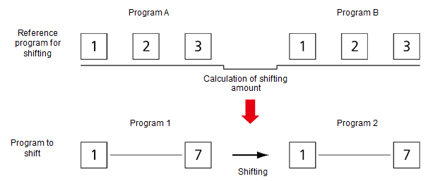
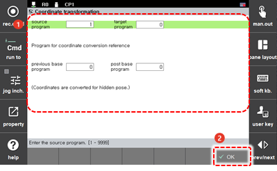

# 4.3.5 坐标移动

坐标移动功能是一个使您能够在没有额外教学的情况下创建程序的功能，即使在工作件的位置不同的情况下，仍然可以将相同形状的工作件放置在不同的位置，如图2所示，在工作件上进行了教学的程序（图1）。

使用坐标移动功能需要有三个参考点。您可以通过在工作件的初始位置标记三个参考点来创建程序A。在移动工作件位置后，使用之前标记的三个参考点编写程序B。


* 坐标移动程序的准确性将受到教学三个参考点准确性的影响。尽可能准确地对三个参考点进行教学。
* 在坐标移动中，将三个参考点之间的距离设置得尽可能远。


您可以通过计算坐标移动量，将现有程序（程序1）移至新程序（程序2），其基础是程序A和程序B的三个步骤。

 

---

在机器人操作期间不允许使用该功能。使用坐标移动的方法如下。

1. 选择[6: 程序转换 - 5: 坐标变换]菜单。坐标移动的设置窗口将出现。
2. 设置完成后，按`[确定]`按钮。

    

* [源程序]：现有教学程序编号（[图1]的程序编号）

* [目标程序]：通过执行坐标转换新创建的程序编号（[图2]的程序编号）

* [先前基准程序]：具有3个标准点的程序编号（[程序A]的编号）

* [后基准程序]：记录转换参考的3个点的程序编号（[程序B]的编号）