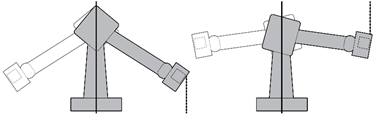
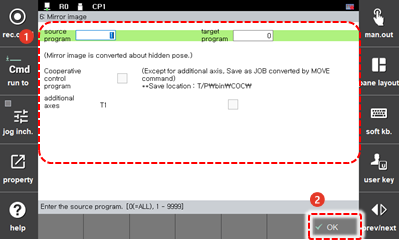

# 4.3.6 镜像

您可以编写一个程序，其中 S 轴的位置和腕轴的姿势基于机器人 S 轴 0° 位置的 Y-Z 平面是对称的。

此功能在指示左右两个机器人执行相同操作时非常有用，例如焊接车辆的车身。首先，给一个机器人教一个操作，然后打开该操作的程序并将其转换为镜像。然后，将写入与 S 轴对称的程序。


镜像功能不支持协作机器人。


在机器人启动期间，将限制使用 `[6: 镜像]` 菜单。使用镜像功能的方法如下。

1. 触摸 `[6: 程序转换 - 6: 镜像] ([6: 程序转换 - 6: 镜像])` 菜单。然后，镜像设置窗口将出现。

2. 在设置镜像转换选项后，触摸 `[OK]` 按钮。

* `[源程序]`/`[目标程序]`: 您可以设置现有程序的编号和通过镜像转换要创建的新程序的编号。

    