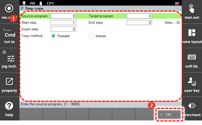

# 4.3.7 步骤复制

您可以将程序的某部分复制到另一个程序或同一程序中。步骤中记录的功能也将被复制。在机器人启动时，使用 `[7: 步骤复制]` 菜单将受到限制。

1. 触摸 `[6: 程序转换 - 7: 步骤复制] ([6: 程序转换 - 7: 步骤复制])` 菜单。步骤复制设置窗口将出现。

2. 设置步骤复制选项后，触摸 `[OK]` 按钮。

    

* `[源程序]`/`[目标程序]`：您可以设置要复制步骤的原始程序的编号，以及您希望通过粘贴复制步骤创建的新程序的编号。如果您将目标程序编号设置为与原始程序编号相同，则原始程序将被新程序覆盖和替换。
* `[开始步骤]`/`[结束步骤]`：您可以设置要复制的步骤范围（初始设置值：1/最后一步）。
* `[插入步骤]`：您可以设置要粘贴复制步骤的参考步骤。复制的步骤将紧接在参考步骤之后粘贴。
* `[复制方法]`：您可以选择复制步骤的进度方向。
  * `[前进/反向]`：您可以按照原始程序的顺序或原始程序的反向顺序粘贴复制的步骤。


* 您无法复制受保护的程序。
* 如果复制的步骤中记录了 END 功能，该功能将一起复制。必要时请删除该功能。
* 如果在复制的步骤中记录了可跳转到复制范围外的步骤的功能 \(GOTO, GOSUB\)，该功能将会被复制，但编号不会自动更改。请在复制后更改该编号。
