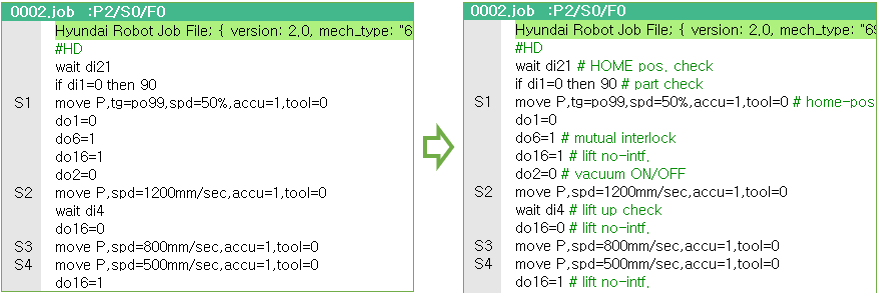
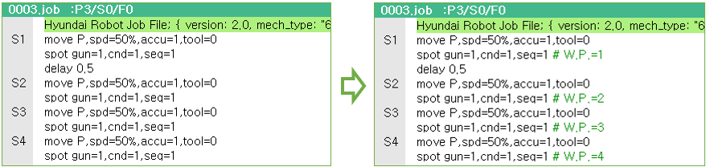
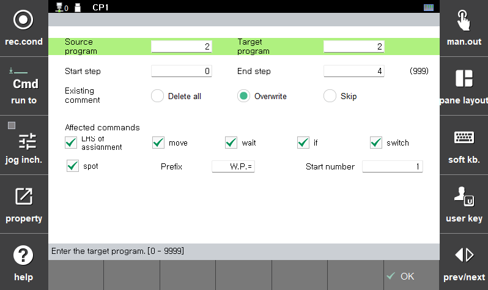

# 4.3.9 명령문 주석

(이 기능은 V70.02-00 및 이후 버전부터 지원됩니다.)

미리 설정된 데이터 주석을 활용하여, 명령문에 주석을 자동으로 붙여주는 기능입니다. 주석을 일괄 삭제하거나, 스폿용접 명령문인 `spot`문에 일련번호를 붙이는 기능도 포함하고 있습니다. 

데이터 주석 설정 방법에 대해서는 [4.11 데이터 주석](../11-data-cmts.md)을 참조하십시오

* 수행 예 1 (신호대입문, `wait`문, `move`문)

 

* 수행 예 2 (`spot`문)



### 조작방법

(1) `[F1]: 서비스 - 6: 프로그램 변환 - 9: 명령문 주석`을 선택합니다.




(2) 아래 조건들을 설정한 후, `[F7: 실행]`키로 실행합니다.

- `원본 프로그램`

  주석을 적용하고자 하는 원본 프로그램의 번호.
  0으로 설정하면 모든 job의 전 영역에 대해 수행합니다.

- `대상 프로그램`

  주석 저장 후 새로 저장할 대상 프로그램의 번호
  `원본 프로그램` 번호와 동일할 경우 덮어쓰게 됩니다.

- `시작스텝` ~ `종료스텝`
  
  기록 조건을 변경하고자 하는 범위. (초기값은 0~마지막 스텝)
  예를 들어, 2~5로 설정하면 스텝 2의 `move`문부터 스텝 5의 마지막 펑션까지 적용됩니다. 

- `기존 주석`

  * `모두 삭제` : 주석의 적용이 아닌 삭제를 수행합니다. (주석 행은 삭제하지 않으며, 명령문 우측의 주석만 삭제합니다.)
  * `덮어쓰기` : 명령문에 기존 주석이 있으면, 덮어씁니다.
  * `건너뛰기` : 명령문에 기존 주석이 있으면, 그 명령어에 대해서는 처리하지 않습니다.


- `적용될 명령어들` (`기존 주석`을 `모두 삭제`로 선택한 경우에는 숨겨집니다.)
  
  주석을 적용할 대상 명령어들을 선택합니다. 

  * `대입문 좌변` : 대입문의 좌변 변수의 주석을 명령문 주석으로 사용합니다.
  * `move` : `tg=` 인수가 있는 move문에 대해, `tg=` 에 설정한 포즈식의 첫 포즈변수의 주석을 명령문 주석으로 사용합니다. 숨은 포즈 `move`문에 대해서는 적용되지 않습니다.
  * `wait`, `if` (`elseif` 포함), `switch` : 조건 파라미터로 지정한 변수의 주석을 명령문 주석으로 사용합니다.
  * `spot` : job 범위 내에서의 일련번호를 명령문 주석으로 사용합니다.
    가령 접두어를 `W.P.=`로 설정하고 시작번호를 101로 설정하면, 첫 `spot`문에는 `W.P.=101`, 두번 째 `spot`문에는 `W.P.=102`와 같은 식으로 주석이 자동 입력됩니다.


- `접두어`
  
  `spot`명령문의 주석으로 적용할 일련번호의 접두어를 정의합니다. 소프트키보드를 활용해 편집하십시오.

- `시작번호`

  `spot`명령문의 주석으로 적용할 일련번호의 시작번호를 설정합니다.

 ------------

### 참고사항

-	명령문의 조건 파라미터가 수식으로 되어 있으면, 수식의 첫 글자를 점유하는 변수를 기준으로 주석이 결정됩니다. 예를 들어, `di1`이 `part check`이고, `di2`가 `vacuum check`이면, 아래의 `if`문에는 `part check`라는 주석이 적용됩니다.

    ```python
    if di1=0 and di2=0 then 90 # part check
    ```

-	job 편집화면의 블록편집 모드에서도 선택된 명령문들에 대해 주석을 자동 입력하거나 제거할 수 있습니다. 적용 조건은 이 화면의 설정을 따르지 않고 아래와 같이 고정 적용됩니다.
  
    * `기존 주석` : `덮어쓰기`
    * `적용될 명령어들` : `spot`을 제외한 모든 명령어

    상세한 내용은 [3.2.4.5 블록 편집 모드](../../3-programming/2-prog-edit/4-statement-edit/5-block-edit-mode.md)을 참조하십시오.
 