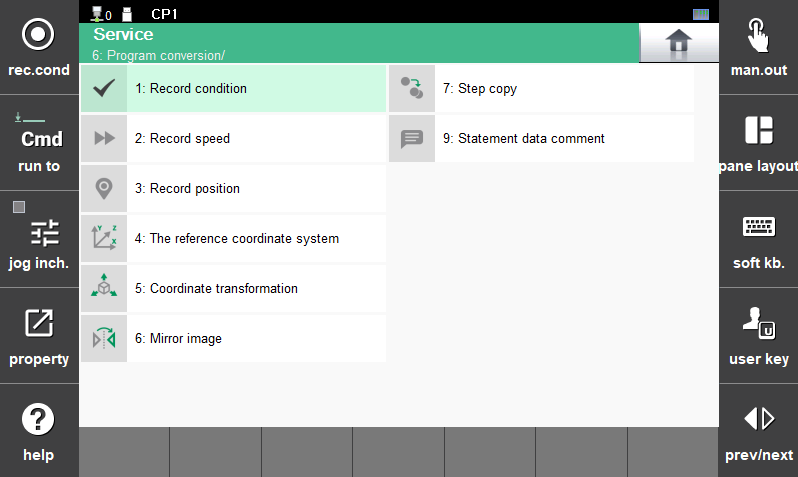

# 4.3 程序转换

您可以通过批量或单独修改创建程序的条件和位置，或通过移动坐标来编写新程序。

1.	触摸 `[6: Program Conversion]` 菜单。然后，程序转换菜单将出现。

2.	选择所需的菜单，然后修改程序条件和位置，或编写新程序。

    

 


在机器人启动期间，将限制使用菜单 `[4: The reference coordinate system]`、`[5: Coordinate transformation]`、`[6: Mirror Image]` 和 `[7: Step Copy]`。
