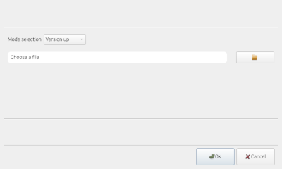
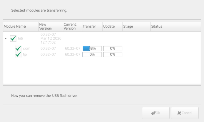
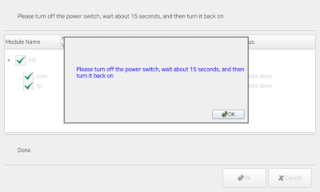

# 4.4.1.1 控制器系统更新

您可以使用集成的压缩文件更新控制器各模块的版本。

1.	将包含集成压缩文件的可移动存储设备连接到教导终端的USB插槽。当可移动存储设备连接到教导终端时，状态栏中将出现`[USB]`图标 \(\)。

2.	触摸功能按钮栏上的`[Ver. Up]`按钮。然后，版本升级程序执行窗口将出现。

3.	通过触摸下拉菜单选择`[Version Up]`模式，使用`[Open]`按钮选择集成压缩文件，然后触摸`[OK]`按钮。

    

4.	选择您想要更新的模块后，触摸`[OK]`按钮。然后，更新将开始。

    

5.	更新完成后，重新启动控制器。

    