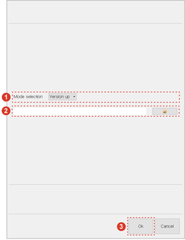

# 4.4.1.1 Controller System Updating

You can update the version of each module of the controller using the integrated compressed file.

1.	Connect the removable storage device containing the integrated compressed file to the USB slot of the teach pendant. When the removable storage device is connected to the teach pendant, the \[USB\] icon \(\) will appear in the status bar.

2.	Touch the \[Ver. Up\] button on the function button bar. Then, the version upgrade program execution window will appear.

3.	Select the \[Version Up\] mode by touching the drop-down menu, select the integrated compressed file using the \[Open\] button, and then touch the \[OK\] button.

4.	After selecting the module that you want to update, touch the \[OK\] button. Then, the update will start.

5.	When the update is completed, touch the \[OK\] button. Then, the version upgrade program execution window will be closed, and the controller will automatically restart.

