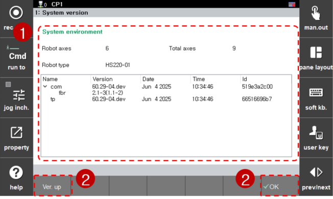

# 4.4.1 系统版本

1. 触摸`[7: System Diagnosis - 1: System version] ([7: System Diagnosis  - 1: System version])`菜单。然后，系统环境设置窗口将出现。

2. 检查和管理机器人和控制器的系统环境（软件版本）信息。

<table>
  <thead>
    <tr>
      <th style="text-align:left">编号</th>
      <th style="text-align:left">描述</th>
    </tr>
  </thead>
  <tbody>
    <tr>
      <td style="text-align:left">
        
      </td>
      <td style="text-align:left">机器人和控制器的系统环境（软件版本）信息</td>
    </tr>
    <tr>
      <td style="text-align:left">
        
      </td>
      <td style="text-align:left">
        
使用功能按钮编辑和管理系统环境。

        <ul>
          <li>[OK]: 菜单将被关闭。</li>
          <li>[Ver. up]: 您可以更新控制器各模块的版本。</li>
        </ul>
      </td>
    </tr>
  </tbody>
</table>