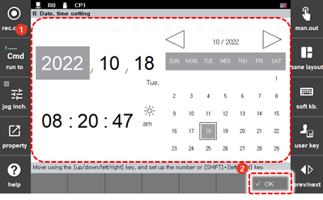

# 4.5 Setting of Date and Time

You can set the date and time of the controller.

1.	Touch the \[8: Date, time setting\] menu. The date and time setting window will appear.

2.	After setting the date and time information, touch the \[OK\] button.

    

* You can perform setting by inputting the date and time by using the operation keys on the teach pendant.
* If you press the arrow keys, the cursor will move between the date and time items \(year/month/day/hour/minute/second/a.m./p.m.\).

* You can input a number by pressing the number keys. You can also adjust the value using the &lt;**SHIFT**+↑/↓&gt; keys.
* Set the date on the calendar. Touch the \[◁/▷\] button to select the year and month and then touch the date.

