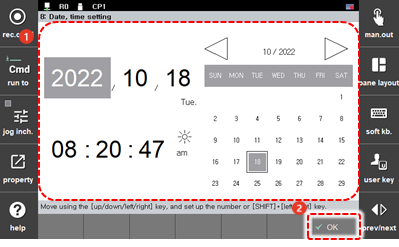

# 4.5 设置日期和时间

您可以设置控制器的日期和时间。

1. 触摸 `8: 日期时间设置 (8: Date, time setting)` 菜单。日期和时间设置窗口将出现。

2. 设置日期和时间信息后，触摸 `[OK]` 按钮。

    

* 您可以通过使用教导 pendant 的操作键输入日期和时间来进行设置。
* 如果您按箭头键，光标将在日期和时间项目间移动 \(年/月/日/小时/分钟/秒/上午/下午\)。

* 您可以通过按数字键输入数字。您也可以使用 `[SHIFT]`+`[↓]` 键调整数值。
* 在日历上设置日期。触摸 `[◁/▷]` 按钮以选择年和月，然后触摸日期。