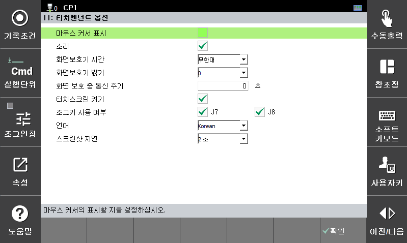

# 4.7 티치펜던트 옵션

티치펜던트의 각종 환경 설정 옵션을 설정합니다.

<table>
  <thead>
    <tr>
      <th style="text-align:left">항목</th>
      <th style="text-align:left">설명</th>
    </tr>
  </thead>
  <tbody>
    <tr>
      <td style="text-align:left">
        마우스 커서 표시
      </td>
      <td style="text-align:left">티치펜던트 화면에 마우스 커서 표시를 ON/OFF 합니다. 
      (V70.04-00 버전부터 지원됩니다.)
      </td>
    </tr>
    <tr>
      <td style="text-align:left">
        소리
      </td>
      <td style="text-align:left">티치펜던트의 비프(beep) 음을 ON/OFF 합니다.</td>
    </tr>
    <tr>
      <td style="text-align:left">
        화면보호기 시간
      </td>
      <td style="text-align:left">마지막 조작 시점부터 설정한 시간이 소요된 후 화면보호기가 작동합니다.</td>
    </tr>
    <tr>
      <td style="text-align:left">
        화면보호기 밝기
      </td>
      <td style="text-align:left">화면보호기의 밝기를 0(꺼짐) ~ 6(약간 어두움) 단계로 설정합니다. (V60.32-06 버전부터 지원됩니다.)</td>
    </tr>
    <tr>
      <td style="text-align:left">
        화면 보호 중 통신 주기
      </td>
      <td style="text-align:left">화면보호기 동작 중, 티치펜던트가 제어기 본체로부터의 정보 수신을 얼마나 느리게 할 지를 통신 주기로 설정합니다. 0으로 설정하면 지연 없이 동일하게 통신합니다. 
      (V60.30-08 버전부터 지원됩니다.)
      </td>
    </tr>
    <tr>
      <td style="text-align:left">
        터치스크린 켜기
      </td>
      <td style="text-align:left">터치스크린을 ON/OFF 합니다. 
      의도하지 않은 화면 접촉에 의한 티치펜던트 오조작이 우려될 경우 이 옵션을 끄십시오. 
      다시 터치스크린을 옵션을 키고자 하는 경우, CTRL + ←(Backspace) 키를 눌러 F 버튼 막대 키패드 모드를 활성한 후 옵션을 다시 활성화 하십시오.1)</td>
    </tr>
    <tr>
      <td style="text-align:left">
        조그키 사용 여부
      </td>
      <td style="text-align:left">조그키 `J7-`/`J7+`와 `J8-`/`J8+`를 사용할 지 각각 선택합니다.  조그키 오조작으로 인한 포지셔너 충돌 등이 우려될 경우 이 옵션을 끄십시오.2)</td>
    </tr>
    <tr>
      <td style="text-align:left">
        언어
      </td>
      <td style="text-align:left">티치펜던트의 표시 언어를 변경합니다. 최상위 화면으로 나간 후 부터 적용됩니다. 
      (V70.00-00 버전부터 지원됩니다.3)) </td>
    </tr>
    <tr>
      <td style="text-align:left">
        스크린샷 지연
      </td>
      <td style="text-align:left">[CTRL]+[SHIFT]+[.]키에 의해 티치펜던트 화면을 캡쳐할 수 있습니다.  이때 캡쳐 동작에 대한 지연 시간을 설정합니다. 참고로 캡쳐된 화면은 파일관리자에서 TP/log 폴더에 screen_?.png 파일로 저장됩니다. 
      (V70.02-00 버전부터 지원됩니다.)</td>
    </tr>
  </tbody>
</table>



1\) 키패드 모드에 관한 자세한 내용은 "[11.2 키패드 모드](../11-etc/2-keypad-mode.md)"를 참고하십시오.

2\) 조그키 사용 여부에 관한 자세한 내용은  "[7.6.6 메커니즘 설정](../7-system/6-initialization/6-mechannism-set.md)"의 메커니즘 조그 규칙을 참고하십시오.

3\) 그 이 전 버전은 `[F1: 서비스] - 9: TP 응용프로그램 종료` 를 수행한 상태에서만 표시 언어를 전환할 수 있습니다.



