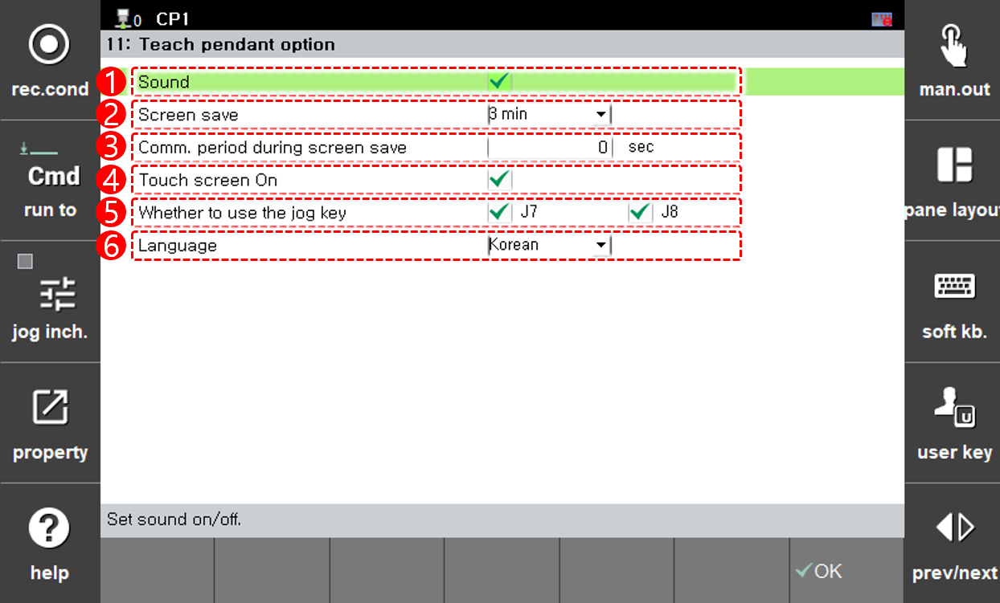

# 4.7 Teach pendant option

Set the sound and screen save time of the teach pendant.

<table>
  <thead>
    <tr>
      <th style="text-align:left">Number</th>
      <th style="text-align:left">Description</th>
    </tr>
  </thead>
  <tbody>
    <tr>
      <td style="text-align:left">
        
      </td>
      <td style="text-align:left">Select whether the teach pendant will make a sound.</td>
    </tr>
    <tr>
      <td style="text-align:left">
        
      </td>
      <td style="text-align:left">Select the time when the teach pendant screen is turned off.</td>
    </tr>
        <tr>
      <td style="text-align:left">
        
      </td>
      <td style="text-align:left">Select whether to use the jog keys <b>J7-/J7+</b> and <b>J8-/J8+</b> respectively.  Turn off this option if there is a risk of positioner collision or other issues due to incorrect jog key operation.
    </tr>
  </tbody>
</table>


For more details on the use of jog keys, refer to the Mechanism Jog Rules in "[7.6.6 Mechanism Settings](../7-system/6-initialization/6-mechannism-set.md)"


