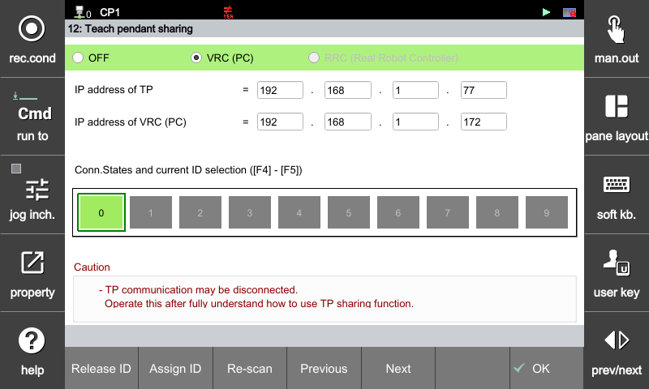

# 4.8 教学 pendant 共享

使用屏幕顶部的单选按钮选择模式。

* OFF : 共享功能被禁用。在正常情况下，应该设置为 OFF，以便教学 pendant 能够正确连接到控制器。

* VRC (PC) : 一个物理教学 pendant 连接到多个在桌面 PC 上运行的虚拟控制器 (VRCs)，并可以通过在它们之间切换来使用。
请参阅 HRSpace4 帮助中的以下部分以获取连接说明。
  + HRSpace4 手册 - 8.4 实际教学 pendant (RTP)

* RRC (真实机器人控制器) : 一个教学 pendant 连接到多个控制器并通过在它们之间切换来使用。
  + 需要额外的可选硬件。此功能目前不受支持。