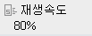
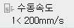
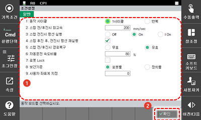

# 5.1    운전 조건 설정

1.	초기 화면에서 좌측 상단의 \[속도조절\] 버튼을 터치하십시오. 운전 조건 설정창이 나타납니다.

      


\[속도조절\] 버튼에는 수동 모드일 때에는 스텝 전후진 제한 속도\(㎜/sec\)가 표시되고, 자동 모드에서는 재생 속도\(%\)가 표시됩니다.


2.	운전 조건 설정값을 변경한 후 \[**확인**\] 버튼을 터치하십시오. 세부 설정값들에 대한 설명은 다음장으로 이어집니다.

    

