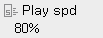
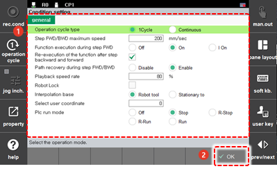

# 5.1 Operation Condition Setting

1. Touch the \[Speed Adjustment\] button on the upper left on the initial screen. Then, the operation conditions setting window will appear.

      


On the \[Speed Adjustment\] button, the speed limit \(mm/sec\) will be displayed while in manual mode, and the playback speed \(%\) will be displayed in automatic mode.


2.	Change the operation condition setting values, and then touch the \[OK\] button.

    

    

