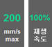
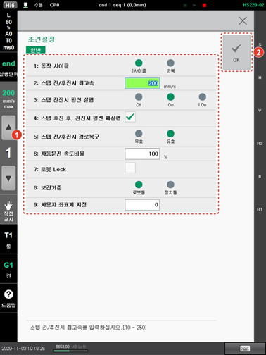

# 5.1    운전 조건 설정

1.	초기 화면에서 좌측 상단의 \[속도조절\] 버튼을 터치하십시오. 운전 조건 설정창이 나타납니다.


\[속도조절\] 버튼에는 수동 모드일 때에는 스텝 전후진 제한 속도\(㎜/sec\)가 표시되고, 자동 모드에서는 재생 속도\(%\)가 표시됩니다.


2.	다음 절차를 반복하여 운전 조건 설정값을 변경한 후 \[OK\] 버튼을 터치하십시오.

a.	티치 펜던트의 조그 다이얼을 돌리십시오. 커서가 이동합니다.

b.	조그 다이얼을 돌려 원하는 옵션을 선택하거나 숫자키를 눌러 수치를 입력하십시오.

c.	&lt;enter&gt; 키를 누르십시오. 변경 내용이 적용되어 설정값이 변경되고 커서가 다음 항목으로 이동합니다.

