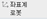
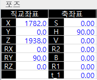
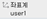
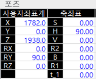

# 5.2    운전 조건 설정 정보

* \[1: 동작 사이클\]: 자동 운전 시 실행되는 프로그램의 반복 여부를 설정합니다. 로봇 기동 중에도 설정할 수 있으며 수동 운전 시에서 설정값이 적용되지 않습니다.
  * 1사이클: 작업 프로그램을 1 회 운전 후 종료합니다. 프로그램 END를 만나면 로봇이 정지합니다.
  * 반복: 작업 프로그램을 연속해서 반복 운전합니다. 외부의 정지 조작이 있으면 로봇이 정지합니다.
* \[2: 스탭 전/후진시 최고속\]: 스텝의 전후진 시 제한 속도를 설정합니다. 이 옵션에 대한 자세한 내용은 “[2.1 수동 운전](../2-operation/1-manual-operation/README.md)”을 참조하십시오.
* \[3: 스탭 전진시 펑션 실행\]: 스텝 전진 시 작업 프로그램에 기록된 기능의 실행 옵션\(방식\)을 설정합니다.
  * Off: 작업 프로그램에 기록된 END만 실행합니다. END를 제외한 다른 모든 기능은 실행하지 않습니다.
  * On: 작업 프로그램에 기록된 모든 기능을 실행합니다.
  * 1 On: 입력 신호 대기 기능과 프로그램 END 기능만 실행합니다.


스텝 후진 시에는 입력 대기 신호 기능만 실행하고 이외의 모든 기능은 실행하지 않습니다.


* \[4: 스텝 후진 후, 전진 시 펑션 재실행\]: 스텝 후진 후 다시 전진할 때 작업 프로그램에 기록된 기능 중 이전에 실행한 기능을 다시 실행하도록 설정합니다.
* \[5: 스텝 전/후진시 경로복구\]: 스텝 전후진 시 경로 복구의 실행 방식을 설정합니다.
  * 무효: 경로 복구를 실행하지 않습니다.
  * 유효: 사용자에게 경로 복구의 실행 여부를 확인하지 않고 수행합니다.
* \[6: 자동운전 속도비율\]: 자동 모드로 프로그램 재생 시 로봇의 운전 속도\(%\)를 설정합니다. 작업 프로그램의 스텝에 기록된 속도를 변경하는 것이 아니라 스텝에 기록된 속도에 대한 로봇의 이동 속도를 1 ~ 100% 범위의 비율\(%\)로 일괄 변경합니다.


스텝 후진 시에는 입력 대기 신호 기능만 실행하고 이외의 모든 기능은 실행하지 않습니다.


* \[7: 로봇 Lock\]: 로봇을 실제로 움직이지 않고 작업 프로그램을 자동 운전하도록 설정합니다. 주변 기기와의 입출력 상태와 소프트 리미트, 사이클 타임 등을 확인할 수 있습니다.
* \[8: 보간기준\]: 수동으로 로봇을 조그 동작할 때 기준이 되는 툴을 설정합니다. 일반적으로 로봇툴을 보간 기준으로 사용합니다.
  * 로봇툴: 로봇 선단에 부착된 툴을 기준으로 보간 동작을 실행합니다.
  * 정치툴: 바닥면 등에 고정된 툴의 선단을 기준으로 보간 동작을 실행합니다. 정치툴을 보간 기준으로 선택하면 초기 화면 좌측의 툴 번호가 ST0으로 표시됩니다\(\).


정치툴을 보간 기준으로 선택한 경우 반드시 정치툴 좌표계를 설정해야 합니다. 자세한 내용은 “[7.3.6.2 정치툴 좌표계](../7-setting/3-control-parameter/6-cordsys-reg/2-stationary-tool-crdsys.md)”를 참조하십시오.


* \[9: 사용자 좌표계 지정\]: 수동 조그 조작 시 직교 동작을 위해 사용자 좌표계 번호\(0 ~ 10\)를 설정합니다. 로봇이 지정된 사용자 좌표계의 X, Y, Z 축 방향으로 직교 좌표계 동작을 수행합니다. 그리고 포즈 모니터링 시 선택한 사용자 좌표계의 좌표값이 툴 선단의 X, Y, Z 좌표값으로 나타납니다.

* 
  0으로 설정하면 화면 우측의 \[좌표계\] 버튼에 로봇 좌표계 아이콘\(\)이 표시됩니다. 사용자 좌표계에 대한 동작이 해제되고 로봇 좌표계에 대한 직교 좌표 동작 및 모니터링을 수행합니다.

* 1 ~ 10 사이의 번호로 설정하면 \[좌표계\] 버튼에 사용자 좌표계 아이콘\(\)이 표시됩니다. &lt;축조작&gt; 키로 변경된 좌표치 값은 사용자 좌표계를 기준으로 합니다.


사용자 좌표계 번호는 \[**시스템** &gt; 2: 제어 파라미터 &gt; 7: 좌표계 등록 &gt;1: 사용자 좌표계\] 메뉴에서 등록할 수 있습니다.


