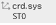
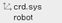
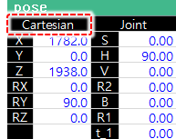
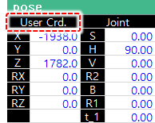

# 5.2 Information of Operation Conditions Setting

* \[1: Operation cycle type\]: You can set whether to repeat the program that will be executed during automatic operation. It can also be set while the robot is starting up, and the setting value will not be applied during manual operation.
  * 
    1 Cycle: The job program will operate once and then stop. When the program END is reached, the robot will stop.

  * Continuous: The job program will operate continuously and repeatedly. If there is an external stop operation, the robot will stop.
* 
  \[2: Step FWD/BWD maximum speed\]: You can set the speed limit for a step forward/backward. For details on this option, refer to ???[2.1 Manual Operation](../operation/manual-operation/).???

* 
  \[3: Function execution during Step FWD\]: You can set the execution option \(mode\) of the function recorded in the job program while in the step forward operation.

  * 
    Off: Only END recorded in the job program will be executed. All other functions except for END will not be executed.

  * 
    On: All functions recorded in the job program will be executed.

  * 
    1 On: Only the input signal wait function and program END function will be executed.


While in the step backward operation, only the input wait signal function will be executed, and all other functions will not be executed.


* \[4: Re-execution of the function after step backward and forward\]: You can perform setting in a way that the previously executed functions among the functions recorded in the job program can be executed again when in the step forward operation again after the step backward operation.
* 
  \[5: Path recovery during step FWD/BWD\]: You can set the mode of executing path recovery when in the step forward/backward operation.

  * Disable: Will not execute path recovery
  * Enable: Will execute path recovery without confirming with the user whether to execute path recovery

* 
  \[6: Playback speed rate\]: You can set the operation speed \(%\) of the robot for playback of a program in automatic mode. It does not refer to changing the speed recorded in the step of the job program, but it refers to changing the ratio, ranging from 1% to 100% of the robot??�s moving speed against the speed recorded in the step in batch.


If a low-speed command is inputted through an external input during automatic operation, the automatic operation speed ratio will not be applied, but the manual maximum speed \(250 mm/s\) will be applied.


* \[7: Robot Lock\]: You can set the job program in a way that automatic operation is possible, without moving the robot. You can check the status of I/O with the peripheral devices, the soft limit, the cycle time, etc.
* \[8: Interpolation base\]: You can set a tool that will be the reference during the manual jogging of the robot. In general, a robot tool is used as an interpolation reference.
  * Robot Tool: Interpolation operation will be executed based on the tool attached to the front end of the robot.
  * 
    Stationary Tool: Interpolation will be executed based on the front end of the tool fixed to, for example, to the floor. If a stationary tool is selected as the interpolation reference, the tool number on the left side of the initial screen will be marked with ST0 \(\).


If you select the stationary tool as the interpolation reference, you must set the stationary tool coordinate system. For details, refer to ???[7.3.6.2 Stationary Tool Coordinate System](../7-setting/3-control-parameter/6-cordsys-reg/2-stationary-tool-crdsys.md).???


* \[9: Select user Coordinate System Designation\]: You can set the user coordinate system number \(0???10\) for Cartesian operation during manual jog operation. Then, the robot will operate based on the Cartesian coordinate system in the directions of X, Y, and Z axes of the designated user coordinate system, and the coordinate values of the user coordinate system selected during the monitoring of the pose will be displayed as X, Y, and Z coordinate values of the front end of the tool.

* 
  If 0 is set, the robot coordinate system icon \(\) will be displayed on the \[Coordinate System\] button on the right side of the screen. The operation based on the user coordinate system will be deactivated, and the operation and monitoring based on the Cartesian coordinates will be performed.

  

* If a number between 1 and 10 is set, the user coordinate system icon \(\) will be displayed on the \[Coordinate System\] button. The coordinate values that are changed by using the &lt;Axis Operation&gt; key will be based on the user coordinate system.

  


You can register the user coordinate system number in the \[Set up &gt; 2: Control Parameter &gt; 7: Coordinate System Registration &gt;1: User Coordinate System\].


