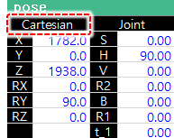
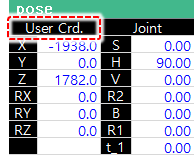

# 5.2 操作条件设置的信息

* `[1: 操作周期类型]`: 您可以设置在自动操作期间是否重复将要执行的程序。它也可以在机器人启动时进行设置，并且设置值不会在手动操作期间应用。
  * 1 次周期: 工作程序将运行一次，然后停止。当程序达到 END 时，机器人将停止。
  * 连续: 工作程序将连续并重复运行。如果有外部停止操作，机器人将停止。
 
 

* `[2: 步骤 FWD/BWD 最大速度]`: 您可以设置向前/向后步骤的速度限制。有关此选项的详细信息，请参阅 "[2.1 手动操作](../2-operation/1-manual-operation/README.md)"。
 

* `[3: 步骤 FWD期间的功能执行]`: 您可以设置在步骤向前操作期间在工作程序中记录的功能的执行选项（模式）。
  * 关闭: 只有在工作程序中记录的 END 将被执行。除了 END 之外的所有其他功能都不会被执行。
  * 开启: 所有在工作程序中记录的功能将被执行。
  * 1 开: 仅输入信号等待功能和程序 END 功能将被执行。


在步骤向后操作期间，仅输入等待信号功能将被执行，所有其他功能将不会被执行。


* `[4: 在步骤向后和向前后的功能重执行]`: 您可以以一种方式进行设置，即在步骤向后操作后再次在步骤向前操作时，可以重新执行工作程序中记录的先前执行的功能。
 

* `[5: 步骤 FWD/BWD期间的路径恢复]`: 您可以设置在步骤向前/向后操作期间执行路径恢复的模式。
  * 禁用: 不会执行路径恢复
  * 启用: 将执行路径恢复而不与用户确认是否执行路径恢复
 
 

* `[6: 播放速度比率]`: 您可以设置机器人在自动模式下播放程序的操作速度（%）。这并不涉及更改工作程序步骤中记录的速度，而是指更改机器人移动速度与步骤中记录的速度之间的比率，范围从 1% 到 100%。


如果在自动操作期间通过外部输入输入了低速命令，将不适用自动操作速度比率，而将适用手动最大速度 \(250 mm/s\)。


* `[7: 机器人锁定]`: 您可以以一种方式设置工作程序，使自动操作在不移动机器人的情况下进行。您可以检查 I/O 与外围设备的状态、软限制、周期时间等。
 

* `[8: 插值基准]`: 您可以设置作为机器人的手动移动参考的工具。一般而言，机器人工具被用作插值参考。
  * 机器人工具: 插值操作将基于附加在机器人前端的工具执行。
  * 固定工具: 插值将基于固定在地面上的工具的前端执行。如果选择固定工具作为插值参考，初始屏幕左侧的工具编号将标记为 ST0 \(\)。


如果选择固定工具作为插值参考，则必须设置固定工具坐标系。有关详细信息，请参阅 "[7.3.6.2 固定工具坐标系](../7-system/3-control-parameter/6-cordsys-reg/2-stationary-tool-crdsys.md)"。


* `[9: 选择用户坐标系指定]`: 您可以在手动操作期间为笛卡尔操作设置用户坐标系编号 \(0~10\)。然后，机器人将在指定的用户坐标系的 X、Y 和 Z 轴方向上进行操作，所选用户坐标系的坐标值将在监视姿态时显示为工具前端的 X、Y 和 Z 坐标值。

  * 如果设置为 0，机器人坐标系图标 \(\) 将显示在状态显示窗口的 `[坐标系统]` 按钮上。基于用户坐标系的操作将被停用，基于笛卡尔坐标的操作和监视将被执行。  
  

  * 如果设置为 1 到 10 之间的数字，用户坐标系图标 \(\) 将显示在 `[坐标系统]` 按钮上。通过使用 `[轴操作]` 键更改的坐标值将基于用户坐标系。  
  


您可以在 `[system - 2: 控制参数 - 6: 坐标系统注册  -1: 用户坐标系统] ([system  - 2: 控制参数  - 6: 坐标系统注册  -1: 用户坐标系统])` 中注册用户坐标系编号。


* `[10: Plc 运行模式]`: 当机器人控制器使用嵌入式 PLC 控制输入/输出信号时，设置控制嵌入式 PLC 的模式。共有 4 种嵌入式 PLC 模式。有关详细信息，请参阅 "[${cont_model} 控制器功能手册 - 嵌入式 PLC](https://hrbook-hrc.web.app/#/view/doc-hi6-embedded-plc/zh/README?cont_model=${cont_model})"。

  * 关闭: 禁用该功能。
  * 停止: 停止嵌入式 PLC 操作。
  * R - 停止（远程停止）: 这是远程模式，并停止与控制器连接的 PC 中 HRLadder 的嵌入式 PLC 操作。
  * R - 运行（远程运行）: 这是远程模式，从与控制器连接的 PC 中的 HRLadder 执行嵌入式 PLC 操作。
  * 运行: 控制器操作下载到控制器的 PLC 程序。在 PC 的 HRLadder 中仅能进行监控。