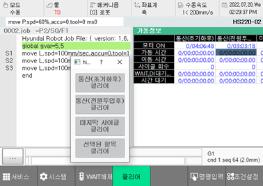

# 6.1.2 가동정보

패널 선택창에서 \[가동정보\]를 터치하십시오. 제어기의 가동 정보창이 나타납니다.

시스템 초기화와 전원 투입, 최근 사이클 시작 직후의 제어기 동작별 누적 시간과 사이클 횟수를 확인할 수 있습니다. 정보 하단의 항목별 \[클리어\] 버튼을 터치하면 가동 정보를 초기화할 수 있습니다.

항목별 조건에 따른 반영 시점은 다음과 같습니다.

<table>
  <thead>
    <tr>
      <th style="text-align:left">항목</th>
      <th style="text-align:left">조건</th>
      <th style="text-align:left">반영 시점</th>
    </tr>
  </thead>
  <tbody>
    <tr>
      <td style="text-align:left">시스템 초기화 후</td>
      <td style="text-align:left">측정 시간</td>
      <td style="text-align:left">시스템 초기화 후부터
        현재 시점 사이에 제어기가
        가동한 시간</td>
    </tr>
    <tr>
      <td style="text-align:left"></td>
      <td style="text-align:left">모터 ON 시간</td>
      <td style="text-align:left">시스템 초기화 후부터
        현재 시점 사이에 제어기의
        모터가 켜져 있었던 시간</td>
    </tr>
    <tr>
      <td style="text-align:left">전원 투입 후</td>
      <td style="text-align:left">측정 시간</td>
      <td style="text-align:left">
        
전원 투입 후부터 현재
          시점 사이에 제어기가
          가동한 시간

        

          
        

      </td>
    </tr>
    <tr>
      <td style="text-align:left"></td>
      <td style="text-align:left">사이클 기록 시간</td>
      <td style="text-align:left">
        
전원 투입 후부터 지난
          사이클까지 제어기가
          가동한 시간

        

          
        

      </td>
    </tr>
    <tr>
      <td style="text-align:left">최근 사이클 시작 후</td>
      <td
      style="text-align:left">측정 시간</td>
        <td style="text-align:left">
          
사이클 시작(또는 전원
            투입) 후부터 현재 시점
            사이에 제어기가 가동한
            시간

          

            
          

        </td>
    </tr>
    <tr>
      <td style="text-align:left"></td>
      <td style="text-align:left">사이클 기록 시간</td>
      <td style="text-align:left">
        
사이클 시작(또는 전원
          투입) 후부터 지난 사이클까지
          제어기가 가동한 시간

        

          
        

      </td>
    </tr>
  </tbody>
</table>

