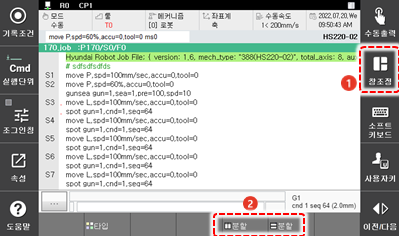
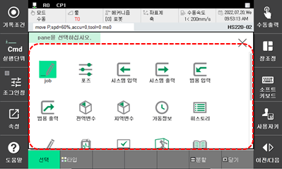

# 6.1 모니터링 기능 사용

1.	화면 우측의 \[창조정\] 버튼과 하단의 [분할] 버튼을 터치한 후 왼쪽 하단의 [선택] 버튼까지 터치 하십시오. 패널 선택창이 나타납니다.

2.	패널 선택창에서 원하는 모니터링 항목을 선택하여 로봇 시스템의 상태와 제어기의 각종 데이터를 확인하십시오.


* 패널 선택창에 모니터링 가능한 모든 항목이 나타납니다.
* 모니터링 가능한 항목은 제어기 설정에 따라 다르게 나타납니다.
* 작업 영역의 패널 스택과 창의 사용 방법에 대한 자세한 내용은 “[1.2.4.5 작업 영역](../1-robot-system/2-basic-usage/4-screen-of-the-hi6-tp/5-work-area.md)”을 참조하십시오.


