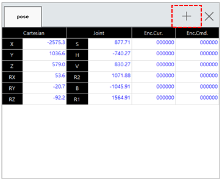
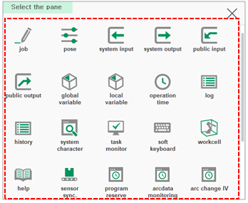

# 6.1 Use of the Monitoring Function

1.	Touch the \[+\] button at the top right of the panel stack in the work area. The panel selection window will appear.

2.	?Œ¨?„� ?„ ?ƒ�ì°½ì—�?„œ ?›�?•˜?Š” 모니?„°ë§? ?•­ëª©ì�„ ?„ ?ƒ�?•˜?—¬ 로봇 ?‹œ?Š¤?…œ?�˜ ?ƒ�?ƒœ??? ? œ?–´ê¸°ì�˜ ê°�종 ?�°?�´?„°ë¥? ?™•?�¸?•˜?‹­?‹œ?˜¤.


* All items that can be monitored will be displayed on the panel selection window.
* 
  The items that can be monitored will be displayed differently depending on the setting of the controller.

* 
  For details on how to use the panel stack and window of the work area, refer to ???[1.2.4.5 Work area](../1-robot-system/2-basic-usage/4-screen-of-the-hi6-tp/5-work-area.md).???


