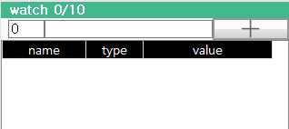
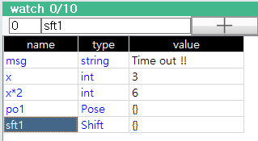
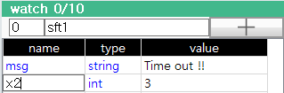
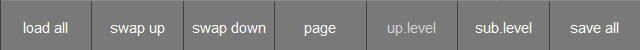

# 6.10 각종 데이터 (watch)

각종 데이터 창에는 원하는 변수나 수식들을 등록하여, 값을 모니터링하거나 변경할 수 있습니다.

## 각종 데이터 창 열기

1. 화면을 분할하고 좌측 하단의 [선택] 버튼을 누릅니다.

&nbsp;

2. 패널 선택창에서 `각종 데이터`를 터치하십시오. 각종 데이터 창이 열립니다.

## 사용 방법

상단의 입력칸에 원하는 변수나 수식을 입력하고 `+` 버튼을 클릭하면 테이블에 새로운 항목으로 입력됩니다.

이름 열을 한번 더 클릭하여 입력한 변수명이나 수식을 수정할 수 있습니다.

값 열을 클릭하여 새로운 값을 입력하면, 해당 변수의 값을 변경하게 됩니다. 수식의 값을 변경하는 행위는 무시됩니다.

포즈/시프트 변수 혹은 수식은 포즈/시프트 속성 창이 열리면서 값을 확인할 수 있고, 변수의 경우는 값을 수정할 수 있습니다.

특정 행에 대해 `SHIFT+DEL`키를 누르면, 해당 행을 삭제합니다.

하단의 F버튼에서 `전부 저장하기` 버튼을 누르면, 작성된 변수, 수식 목록을 `cfg/watch.json` 파일에 저장합니다. 이 파일은 전원 재부팅 시 자동으로 불러옵니다.
이 파일을 FTP 등을 통해 외부 PC에서 전송 받아 편집할 수도 있습니다. 편집된 파일을 다시 cfg/ 폴더로 덮어쓴 후 `전부 불러오기` 버튼을 클릭하면 각종 데이터 창에 반영됩니다.

`위로 교환`, `아래로 교환` 버튼을 클릭하면 현재 선택된 행의 위치를 위, 아래의 행과 교환하면서 이동 시킬 수 있습니다.  

각종 데이터 창에는 총 10개의 페이지가 있어, 표시하고 싶은 변수나 수식을 그룹핑해 관리할 수 있습니다. `페이지` 버튼을 클릭하면 다음 페이지를 보여주고, `SHIFT`+`페이지` 버튼을 클릭하면 이전 페이지를 보여줍니다.

배열이나 객체는 [F6: 하위레벨] 버튼이나 `ENTER`키로 하위 요소들을 볼 수 있으며, [F5: 상위레벨] 버튼이나 `ESC`키로 상위레벨로 올라갈 수 있습니다.

시작 인덱스 편집박스에 값을 입력하여 특정 배열 요소부터 표시하도록 할 수 있습니다. ([전역변수](8-global-variable/README.md) 창과 조작방법이 동일합니다.)


* 결과값 표시를 갱신하기 위해 수식은 빠른 주기로 수행됩니다. mkucs()와 같이 시스템에 특정한 생성이나 변경을 유발하는 함수는 수식 내에 포함시키지 않도록 유의하십시오.
