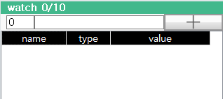

# 6.11 Watch

You can register variables or expressions to the watch panel to monitor or change values.

## Open watch panel

1. Split the screen and press the [Select] button at the bottom left.

&nbsp;

2. Touch `Watch` in the panel selection window. Various data windows open.

## How to use

Enter the desired variable or expression in the top input box and click the '+' button to enter the new item in the table.

You can modify the variable name or expression that you entered by clicking the `Name` column one more time.

If you click in the `Value` column to enter a new value, you will change the value of that variable. Changing the value of an expression is ignored.

Select the `Value` column for the pose/shift variable or expression and press the `ENTER` key to open the Pose/Shift Properties window to view and modify the values.

To delete a row, select the row and press the `SHIFT+DEL` key.

If you press the [F7: Save all] button on the F-button at the bottom, the list of variables and expressions entered is saved in the `cfg/watch.json` file. This file is automatically loaded on power reboot.
You can also edit this file by receiving it to an external PC, via FTP. If you overwrite the edited file with the `cfg/` folder and click the [F1: Load All] button, it will be applied to the Watch panel.

Click the [F2: swap up] and [F3: swap down] buttons to move the position of the currently selected row while exchanging it with the top and bottom rows.  

There are a total of 10 pages in various data windows, so you can group and manage the variables or expressions you want to display. Click the [F4: Page] button to show the next page, and click the `SHIFT`+[F4: Page] button to show the previous page.

The elements of array or object can be viewed with the [F6: sub.level] button or the `ENTER` key, and can go up to the upper level with the [F5: up.level] button or the `ESC` key.

You can enter a value in the `Start Index` edit-box to display an array from a specific index. ([Global Variable](8-global-variable/README.md) window has the same method of operation.)

{% 
* To update the display of the result values, the expressions are calculated repeatedly at a fast period. Be careful not to include functions in the expression that cause system-specific creation or changes, such as mkucs().
{% 
