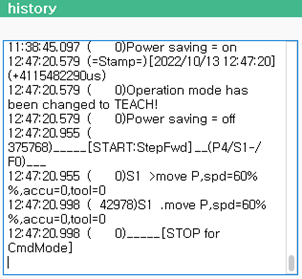

# 6.12 History

In the panel selection window, touch \[history\]. The history window will appear. 

You can check the history in which the execution log and time stamps of the job program are outputted.

