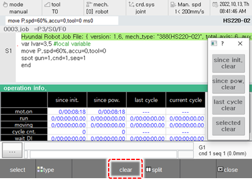

# 6.12 Operation time

In the panel selection window, touch \[Operation time\]. Then, the controller’s operation information window will appear.

You can check the accumulated time and number of cycles for each operation of the controller created immediately after system initialization, power input, and the start of the recent cycle. You can initialize the operation information by touching the \[Clear\] button for each item at the bottom of the information.

The timing of reflection in accordance with the conditions of individual items is as follows.

