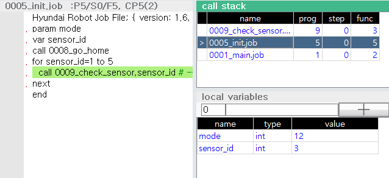

# 6.14 호출 스택

패널 선택창에서 \[호출 스택\]을 터치하면 호출 스택창이 나타납니다. 이 절의 내용을 이해하려면 먼저 hrscript의 `call`~`return`문과 지역변수에 대한 이해가 선행되어야 합니다.

[call문, jump문과 서브프로그램](https://hrbook-hrc.web.app/#/view/doc-hrscript/korean/3-flowcontrol-subprogram/7-call-jump/README)

[지역변수](https://hrbook-hrc.web.app/#/view/doc-hrscript/korean/3-flowcontrol-subprogram/8-local-global-var/1-local-var)


### 로봇언어의 호출과 리턴

로봇언어에서는 `call`문으로 서브 job 프로그램을 호출(call)할 수 있습니다. 서브 프로그램은 `end`나 `return`문을 수행할 때 자신을 호출한 call문의 다음 명령문 위치로 리턴(return)합니다. 예를 들어 아래 그림에서, 5번 job은 8번 job을 호출하여 수행하다가 `return`문을 만나서 다시 5번 job의 `call`문의 다음 명령문부터 수행을 계속해나가는 것을 볼 수 있습니다. 


프로그램 옆에 그려진 그릇 모양은 호출 스택(call stack)이라는 저장공간입니다. 호출 스택에는 현재 수행되는 프로그램의 호출 프레임(call frame)이 쌓입니다. 호출 프레임 안에는 job 프로그램의 실매개변수와 지역변수 집합, 복귀할 주소(return address)가 저장됩니다.  
서브 프로그램이 호출되면 새로운 호출 프레임이 최상단(top)에 쌓이기(push) 때문에, 자신을 호출한 프로그램의 지역변수는 보관되고 새로운 지역변수 공간이 준비됩니다.  
서브 프로그램이 리턴되면 top 호출 프레임은 버리고(pop), 그 아래에 있던 호출 프레임이 다시 top이 됩니다. 호출 프레임에는 call 직전의 실매개변수, 지역변수가 그대로 보관되어 있고, 복귀할 위치 정보도 있기 때문에, 호출한 프로그램은 call 직전에 하던 작업을 그대로 이어 수행할 수 있습니다.


### 호출 스택창

호출 스택창으로 현재 호출 스택의 내용을 확인할 수 있습니다.
<br><br>

0001_main.job
```python
var n_work=10
call 0005_init,12
end
```

0005_init.job
```python
param mode
var sensor_id
call 0008_go_home
for sensor_id=1 to 5
  call 0009_check_sensor,sensor_id # --------- (A)
next
end
```

0008_go_home.job
```python
var pos1, pos2
# do something
end
```

0009_check_sensor.job
```python
param id
var sensor_value
# do something  --------- (B)
end
```

job 편집창과 호출 스택창, 지역 변수창이 떠 있는 상태에서, 현재 프로그램이 5번 job의 `for`~`next` 루프 내부의 call문이 3번째 수행되어 (B) 위치까지 실행된 상태라고 한다면, 티치펜던트 화면은 아래 그림과 같은 상태일 것입니다.


호출 스택의 맨 아래 프레임에는 1번 job, 그 위의 프레임에는 5번 job, 최상단(top) 프레임에는 9번 job이 쌓여있습니다. > 모양의 커서는 9번 job을 가리키고 있고, 지역변수 창에는 매개변수 `id`와 지역변수 `sensor_value`의 값이 표시되고 있습니다. 따라서, 9번 job은 5번 job에 의해 호출됐고, 5번 job은 1번 job에 의해 호출됐다는 정보를 확인할 수 있습니다.  
5번 job이 호출을 한 위치까지 보고 싶다면 5번 job의 프레임을 선택하고 `ENTER`키를 누르십시오, job 편집창의 커서가 즉각 (A) 위치로 이동하여 call을 수행한 위치를 보여주며, 지역변수 창에는 5번 job의 프레임 내용, 즉 매개변수 `mode`와 지역변수 `sensor_id`의 값이 각각 call 직전의 값인 12와 3으로 표시됩니다.



이와 같이 호출한 job의 프레임을 선택하여 이제까지 호출된 프로그램의 흐름을 쉽게 파악할 수 있습니다.


\[주의\] Step-FWD나 재생을 수행할 떄는 작업을 재개할 때는 > 커서를 반드시 최상단(top) 프레임 위치로 복구하십시오. 그러지 않으면, job 커서의 위치가 바뀐 것으로 간주되어 호출스택이 초기화된 채로 수행됩니다.

