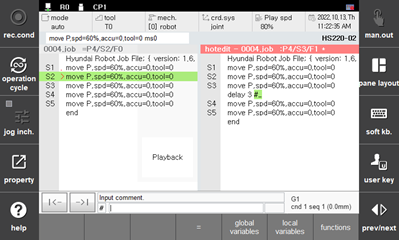
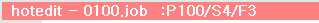

# 6.14 Hot Edit

This is the function to edit the program without stopping it, while playback is still running. 


* When you edit and apply the program that is currently in auto operation or program that will be called, it will be applied from the next cycle (After the program end is executed) and play back the robot with the edited program. Please take maximum precaution since the wrongly implemented editing can cause major accident such as collision between robot and jig.

  

### Entry 

Touch the \[hot edit\] button at the panel, and Hot Edit window of the current program will be open.

 

### Types of possible edit

Although the operation is the same as that of manual mode, the following functions cannot be used.

1) <**Axis operation**>** key use : Ignores the input of the relevant key.
2) <**REC**> key (Record hidden pose MOVE) : Displays the “Operation not allowed while in Hot Edit” message.
3) <**POS. MOD**> key : Displays the “Operation not allowed while in Hot Edit” message.

    

 

### Reflection 

If you have finished the program edit, click the button  on the left side of the guide display bar to open the pop-up menu, and select [hotedit: request to apply].

 

The actual timing of the reflection is displayed in the following table.

<table>
<thead>
  <tr>
    <th>Status</th>
    <th>Program</th>
    <th>After request, reflection timing</th>
  </tr>
</thead>
<tbody>
  <tr>
    <td>Not running</td>
    <td>-</td>
    <td>immediately applied</td>
  </tr>
  <tr>
    <td rowspan="2">Running</td>
    <td>Not running program (Job not included in call stack)</td>
    <td>immediately applied</td>
  </tr>
  <tr>
    <td>Running program (Job included in call stack)</td>
    <td>at start of the next cycle</td>
  </tr>
</tbody>
</table>

 

### Title bar display

  A current status symbol is displayed on the right side of the title bar in the Hot Edit window.

  \'*' symbol means that the teaching program has been modified and is different from the current running program.  
  
  

  \'>' symbol means that Hot Edit has been requested, while the program is running. 

  

  ' '(blank) symbol means that the request has not been reflected yet, or has already been reflected and so the program is the same as the running one.  
  
  

 

### Different program selection

When you press the <**SHIFT**> + <**PROG**> key, you can select a different program. You can also create a new program.
