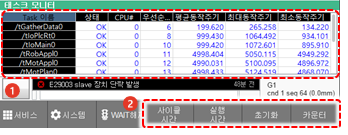

# 6.14 태스크

패널 선택창에서 \[태스크\]를 터치하십시오. 태스크창이 나타납니다.

태스크별 동작 주기와 실행 시간 정보를 확인할 수 있습니다.

<table>
  <thead>
    <tr>
      <th style="text-align:left">번호</th>
      <th style="text-align:left">설명</th>
    </tr>
  </thead>
  <tbody>
    <tr>
      <td style="text-align:left">
        
      </td>
      <td style="text-align:left">
        <ul>
        태스크별 동작 주기와
        실행 시간 정보를 표시합니다
        </ul>
      </td>
    </tr>
    <tr>
      <td style="text-align:left">
        
      </td>
      <td style="text-align:left">
      <ul>
          <li>[사이클 시간]/[실행 시간]:
            태스크별 정보 유형을
            변경합니다.</li>
          <li>[초기화]: 표시된 정보를
            초기화합니다.</li>
          <li>[카운터]: 태스크 모니터가 정상인 동안 카운터가 증가합니다..</li>
        </ul>
      </td>
    </tr>
  </tbody>
</table>

