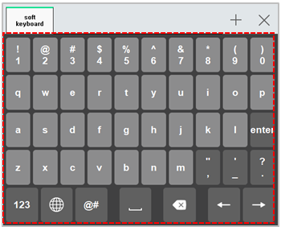

# 6.15 Soft Keyboard

In the panel selection window, touch \[Soft Keyboard\]. Then, a soft keyboard window will appear. 

You can input variables, expressions, and strings, which include numbers, characters, symbols, and special symbols. For details on how to use the soft keyboard, refer to ???[3.2.4.4 Soft Keyboard](../3-programming/2-prog-edit/4-statement-edit/4-softkeyboard.md).???

