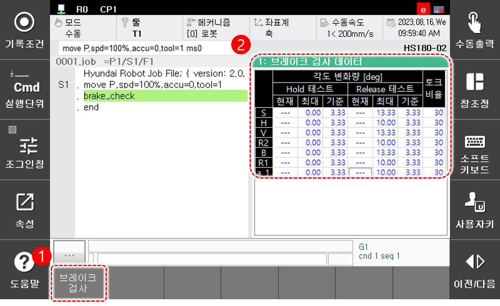

# 6.17 시스템 진단

패널 선택창에서 \[시스템 진단\]을 터치하십시오. 최초 실행 시 브레이크 검사 데이터 창이 나타납니다.

<table>
  <thead>
    <tr>
      <th style="text-align:left">번호</th>
      <th style="text-align:left">설명</th>
    </tr>
  </thead>
  <tbody>
    <tr>
      <td style="text-align:left">
        
      </td>
      <td style="text-align:left">
        
[시스템 진단] 패널을 클릭한 상태에서 아래 버튼을 클릭하여 다른 검사 항목으로 전환할 수 있습니다.

        <ul>
          <li>[브레이크 검사]: 브레이크 검사 데이터 화면으로 전환합니다.</li>
          <li>[가스압력 검사]: 가스스프링 압력 검사 데이터 화면으로 전환합니다.</li>
        </ul>
      </td>
    </tr>
    <tr>
      <td style="text-align:left">
        
      </td>
      <td style="text-align:left">
        
브레이크 Hold/Release 시 현재 토크, 최대 토크, 기준 토크와 토크 적용 비율을 표시합니다.

        <ul>
          <li>검사 중 현재 토크값이 표시됩니다.</li>
          <li>기준값 설정 모드인 경우 축 이름이 노란색으로 표시됩니다.</li>          
        </ul>
      </td>
    </tr>
    <tr>
      <td style="text-align:left">
        
      </td>
      <td style="text-align:left">
        
가스스프링 압력 검사 시 압력 기준값 및 추정값을 표시합니다.

        <ul>          
          <li>[정지]: 정지상태 가스스프링 압력 검사 결과를 표시합니다.</li>
          <li>[명령]: 가스스프링 압력 검사 명령을 수행한 결과를 표시합니다.</li>
        </ul>
      </td>
    </tr>
  </tbody>
</table>


* \[가스압력 검사\] 화면은 가스스프링 압력 검사 기능을 지원하는 로봇에 대해서만 지원합니다.
* 시스템 진단 기능에 대한 자세한 내용은 별도의 “Hi6 제어기 시스템 진단 기능 설명서”를 참조하십시오.


