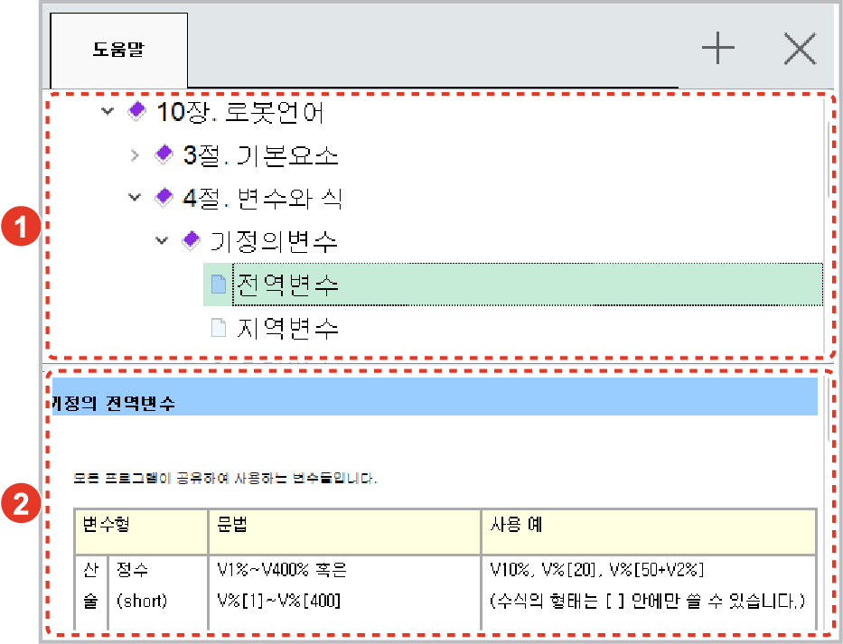

# 6.17 도움말

패널 선택창에서 \[도움말\]을 터치하십시오. 제어기의 도움말 창에서 Hi6 제어기의 사용 정보를 확인할 수 있습니다.

<table>
  <thead>
    <tr>
      <th style="text-align:left">번호</th>
      <th style="text-align:left">설명</th>
    </tr>
  </thead>
  <tbody>
    <tr>
      <td style="text-align:left">
        
      </td>
      <td style="text-align:left">
        
제어기의 도움말 목록입니다.

        <ul>
          <li>[
            ]/[
            ]: 하위 항목을 숨기거나
            표시합니다.</li>
          <li>[
            ]: 하단에 선택한 항목의
            상세 내용을 표시합니다.</li>
        </ul>
      </td>
    </tr>
    <tr>
      <td style="text-align:left">
        
      </td>
      <td style="text-align:left">상단의 도움말 목록에서
        선택한 항목의 상세 내용을
        표시합니다.</td>
    </tr>
  </tbody>
</table>

